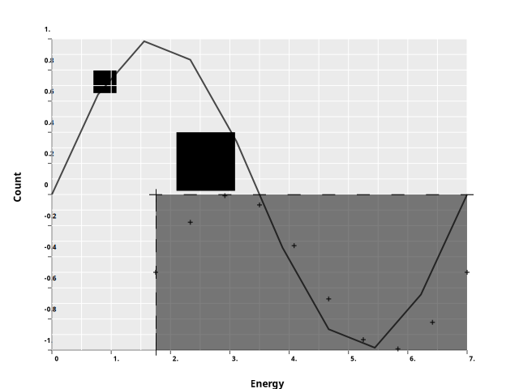

### Milestones :rock:
- :green_circle: Port ginger and ggplot logic :bar_chart:
    - :red_circle: clean up / refactor / fix todos :broom:
    - :red_circle: write tests :mag:
- :red_circle: Release alpha version :abc:
- :red_circle: Add additional features :building_construction:
    - :red_circle: features from R ggplot eg geom_hex
    - :red_circle: features skipped for alpha version eg TEX VEGA and FormulaNode
- :red_circle: Allow creating interactive plots :rocket:

