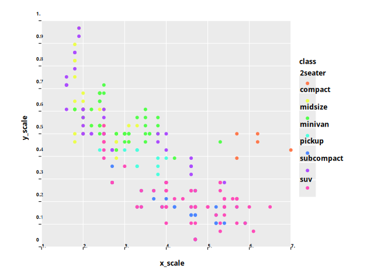
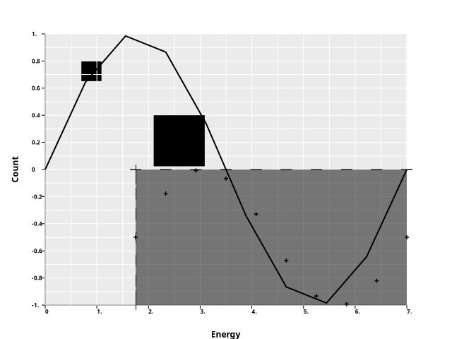

### Milestones :rock:
- :green_circle: Port ginger and ggplot logic :bar_chart:
    - :red_circle: clean up / refactor / fix todos :broom:
    - :red_circle: write tests :mag:
- :red_circle: Release alpha version :abc:
- :red_circle: Add additional features :building_construction:
    - :red_circle: features from R ggplot eg geom_hex
    - :red_circle: features skipped for alpha version eg TEX VEGA and FormulaNode
- :red_circle: Allow creating interactive plots :rocket:

plots are still in progress, but some examples:
```
    mpg = pd.read_csv(data_path / "mpg.csv")  # type: ignore
    plot = ggplot(mpg, aes("class")) + geom_bar()
    res = ggcreate(plot)
    ggdraw_plot(res, data_path / "geom_bar.png")
```

```
    mpg = pd.read_csv(data_path / "mpg.csv")  # type: ignore
    plot = (
        ggplot(mpg, aes(x="displ", y="cty", color="class"))
        + geom_point()
        + ggtitle("gg plotting")
    )

    res = ggcreate(plot)
    ggdraw_plot(res, data_path / "geom_point.png")
```



